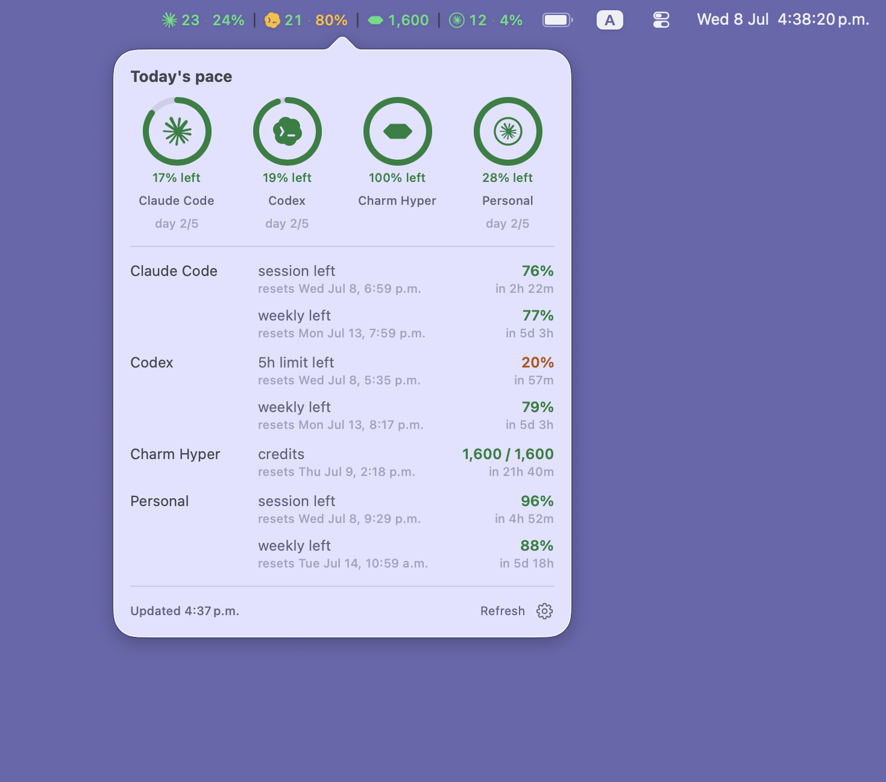
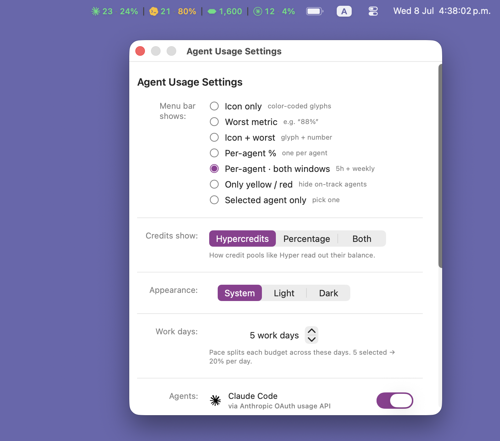

# agent-usage-tray

Monitor **every** coding agent's usage budget at a glance — Claude Code, Codex, and whatever
comes next — from one place. A cross-platform **CLI** with a single output contract, plus a
**macOS menu bar** app and a **Linux COSMIC** applet that consume it.

This is the agent-agnostic successor to
[`claude-code-usage-indicator`](https://github.com/Fuabioo/claude-code-usage-indicator): same
pace-based coloring and dashboard ideas, generalized so that adding an agent is a small, isolated
change.

## Screenshots

The menu bar shows each agent's `weekly · session %`, color-coded by pace; the dashboard popover
adds per-agent ring gauges, reset countdowns, and burn-rate context. _(This example runs a
multi-account, power-user setup — Codex, an opt-in [Charm Hyper](https://hyper.charm.land) credit
pool, and a second "Personal" Claude login. A fresh install shows just Claude Code + Codex.)_



Settings control what the menu bar shows, how credit pools read out, appearance, the work-day pace
split, and which agents are enabled:



## Status & roadmap

| Priority | Component                         | State                                            |
| -------- | --------------------------------- | ------------------------------------------------ |
| 1        | **`agent-usage` CLI**             | ✅ working — Claude (live), Codex (live), `all`   |
| 2        | **macOS menu bar app**            | ✅ working — multi-agent bar + dashboard + settings |
| 3        | Linux COSMIC panel applet         | ⏳ planned (Rust/libcosmic, links the core)       |

The UI target is `Agent Usage Prototype (standalone).html`: a multi-agent menu bar (each agent
shows `weekly·session %`, color-coded by pace) and a dashboard with per-agent ring gauges,
burn-rate alerts ("out ~Thu at this rate"), and an agent list where each agent declares its
own source ("via cc-usage CLI", "via local config", "via gcloud auth", …).

## Architecture

A small Cargo workspace. The core is pure logic; only the providers touch the network.

```
crates/
  agent-usage-core/        Pure logic, no GUI/network deps:
                           - Provider trait (the contract every agent implements)
                           - normalized schema: Window + Metric (percent-utilization OR
                             a consumable credit Pool), AgentInfo, Usage
                           - pace coloring (weekly pace, session thresholds, pool color)
                           - projection (burn-rate → depletion date, "out before reset?")
  agent-usage-providers/   Concrete providers + a registry:
                           - claude  (real — Anthropic OAuth usage API; file + macOS Keychain)
                           - codex   (real — Codex/ChatGPT usage API at backend-api/wham/usage;
                             ChatGPT token from ~/.codex/auth.json — live, like Claude)
                           - shared creds + tiny blocking HTTP helper (ureq)
  agent-usage-cli/         `agent-usage` binary: per-agent subcommands, one JSON/`--status`
                           contract for every agent.
macos/
  AgentUsageMenuBar/       macOS menu bar app (Swift/AppKit + SwiftUI). Spawns the bundled
                           `agent-usage all --json`, renders a per-agent bar indicator + a
                           dashboard popover (ring gauges, pace, burn-rate alerts) + settings.
  build-app.sh             Build the CLI + Swift app and assemble AgentUsageMenuBar.app.
```

**Why one normalized schema?** Agents measure usage differently. Claude reports rolling
percent-utilization windows; a credit-based agent reports a balance that burns down and can run
out before it refills. Every provider normalizes into a flat list of `Window`s, each carrying
either a `Utilization { used_pct }` or a `Pool { total, remaining, burn_per_day }` metric — so
the menu bar, dashboard, and CLI never special-case an agent.

**Adding an agent** = one module in `agent-usage-providers` implementing `Provider`, plus one
line in the registry. It then appears in `agent-usage list`, `agent-usage <id>`, and
`agent-usage all` automatically.

**Dependencies are kept minimal:** the core needs only `serde`/`chrono`/`thiserror`; providers
add a tiny blocking `ureq` (no async runtime, no `reqwest`) since the CLI is one-shot; the CLI
adds only `clap`.

## CLI

```sh
agent-usage claude            # JSON snapshot for one agent (default output)
agent-usage claude --status   # human-readable report
agent-usage all               # JSON array: every default agent (Claude + Codex out of the box)
agent-usage list              # list the default agents and their sources
agent-usage hyper             # opt-in agent — works directly once HYPER_API_KEY is set

# Common flags (same for every agent):
agent-usage claude --creds-path /path/to/.credentials.json
agent-usage claude --daily-budget 20 --work-days 5
agent-usage claude --timeout 30
agent-usage claude --keychain-service "Claude Code-credentials"   # macOS
agent-usage claude --no-keychain
agent-usage claude --cache-ttl 60      # reuse a cached snapshot for N secs (0 = always fetch)
agent-usage claude --no-cache          # never read/write the cache
```

**Caching.** JSON results are cached per agent at `~/.cache/agent-usage/<id>.json`. Repeated
calls within `--cache-ttl` (default 60s) reuse the cached snapshot instead of re-hitting the
usage source — this keeps the app's frequent polling from tripping API rate limits. On a
*transient* failure (rate limit, network) the last good snapshot is served instead of an error,
marked `"stale": true`; auth/credential errors still surface. (`--status` always fetches live.)
See [ADR-003](docs/ADR/003-caching-and-resilience.md).

The JSON document is the stable contract the GUIs consume. On failure it still prints valid
JSON with an `error` object and exits non-zero. Shape (success):

```jsonc
{
  "agent":  { "id": "claude", "label": "Claude Code", "source": "Anthropic OAuth usage API" },
  "fetched_at": "2026-06-12T16:03:39Z",
  "config": { "daily_budget": 20.0, "work_days": 5 },
  "windows": [
    { "kind": "weekly",  "label": "weekly",  "used_pct": 58.0, "remaining_pct": 42.0,
      "resets_at": "...", "resets_in_secs": 294981, "pace": "green" },
    { "kind": "session", "label": "session", "used_pct": 4.0,  "remaining_pct": 96.0,
      "resets_at": "...", "resets_in_secs": 13581,  "pace": "green" }
  ],
  "pace": { "work_day_index": 4, "daily_ceiling": 80.0, "remaining": 22.0,
            "reset_day_local": "Mon Jun 15, 8:00 PM" }
}
```

Credit-pool agents add a `pool` block to their window (the contract is already designed for
them, even though no built-in provider uses it yet):

```jsonc
{ "kind": "credits", "label": "hypercredits", "used_pct": 87.8, "remaining_pct": 12.2,
  "pace": "red",
  "pool": { "total": 5000, "remaining": 610, "burn_per_day": 310,
            "projected_depletion": "...", "depletes_before_reset": true } }
```

### Pace coloring

- **Weekly** window: pace-based on **today's headroom**. Ceiling = `work_day_index *
  daily_budget`; `remaining = ceiling - used`. Bands scale with `daily_budget` (for the default
  20%/day: **surplus ≥ 40% left, green > 10%, yellow 5–10%, red ≤ 5% or over**) — surplus when
  you're a full day or more ahead of pace (banked budget; rendered mint with a glow), green
  above half a day's headroom, yellow down to a quarter day, red at a quarter day or less. So
  being a full day under pace late in the week reads green (or surplus), not "approaching the
  ceiling". `work_day_index` is counted in your **local timezone** — each reset-aligned period is
  attributed to the calendar day its working hours fall on, so a Monday-8pm reset makes Friday day
  4 of 5 (next Monday is the 5th). See [ADR-002](docs/ADR/002-pace-and-work-day-model.md).
- **Session** window: fixed thresholds (`≤50` green, `≤80` yellow, else red).
- **Credit pool**: red if projected to deplete before reset (or `≥90%` used), yellow at `≥75%`,
  else green.

## macOS menu bar app

`macos/AgentUsageMenuBar` is a menu-bar-only (`LSUIElement`) Swift/AppKit + SwiftUI app that
bundles and spawns the `agent-usage` CLI and renders its JSON. See
[ADR-004](docs/ADR/004-macos-frontend.md) for the design.

- **Menu bar** — one configurable indicator, agents separated by a divider and tinted by pace
  (mint when in surplus). Display modes (Settings → "Menu bar shows"): *icon only* (color-coded
  glyphs), *worst metric* (single highest %), *icon + worst*, *per-agent %*, *per-agent · both
  windows* (`weekly · session`, the default), *only yellow/red* (hide on-track agents), and
  *selected agent only*.
- **Dashboard popup** — "Today's pace": a ring gauge per agent showing today's headroom
  ("20% left", or "out ~Thu" for a depleting pool) and the agent's own work day (`day N/M`, since
  agents renew on different days); a burn-rate alert banner for any pool projected to run dry; and
  per-window rows showing each window's remaining plus its exact local reset moment ("resets Mon
  Jun 15, 8:00 PM · in 3d 8h"). Footer shows last-updated (with a "cached" marker when serving
  stale data), Refresh, and a settings gear.
- **Settings** — display mode, appearance (System/Light/Dark), work days, and per-agent enable;
  persisted in `UserDefaults`. Right-click the bar item for Refresh / Settings / Launch at Login /
  Quit.

Agent logos are committed vector PDFs (rendered from each agent's SVG with `macos/render-logos.sh`
via headless Chrome) and tinted per pace, so glyphs stay crisp at any size.

```sh
macos/build-app.sh                 # build CLI + app, assemble macos/build/AgentUsageMenuBar.app
open macos/build/AgentUsageMenuBar.app
```

Requires the Swift toolchain (Xcode Command Line Tools) plus Rust. The app finds the CLI via
`$AGENT_USAGE_BIN`, then its bundled `Resources/agent-usage`, then `PATH`.

## Design docs

Architecture decisions are recorded under [`docs/ADR/`](docs/ADR/):

- [ADR-001](docs/ADR/001-agent-agnostic-architecture.md) — agent-agnostic architecture (workspace,
  `Provider` trait, normalized schema, one JSON contract).
- [ADR-002](docs/ADR/002-pace-and-work-day-model.md) — pace coloring (today's-headroom bands,
  surplus) and the local-timezone work-day model.
- [ADR-003](docs/ADR/003-caching-and-resilience.md) — per-agent snapshot cache and stale-on-error.
- [ADR-004](docs/ADR/004-macos-frontend.md) — macOS frontend: consuming the CLI JSON, menu-bar
  display modes, and vector-PDF logo rendering.

## Build & test

```sh
cargo build              # builds the whole workspace
cargo test               # runs core + provider + CLI tests
cargo run -p agent-usage-cli -- claude --json
```

Requires a Rust toolchain. (No `just`/Homebrew packaging yet — that lands later.)

## License

MIT
