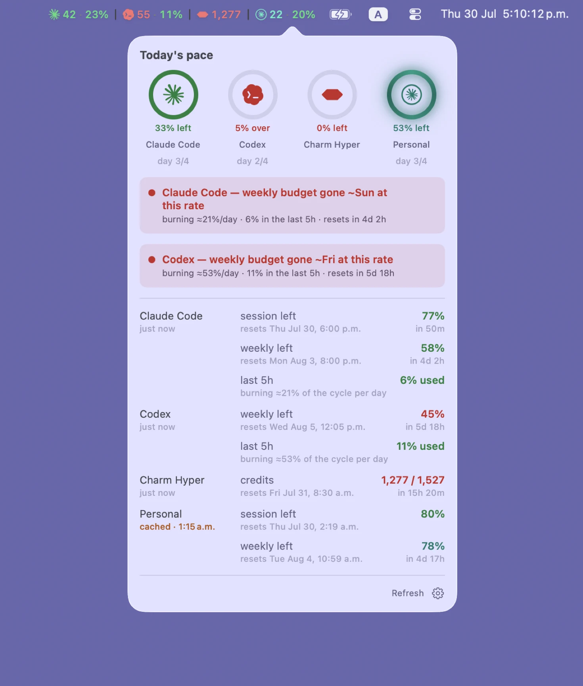
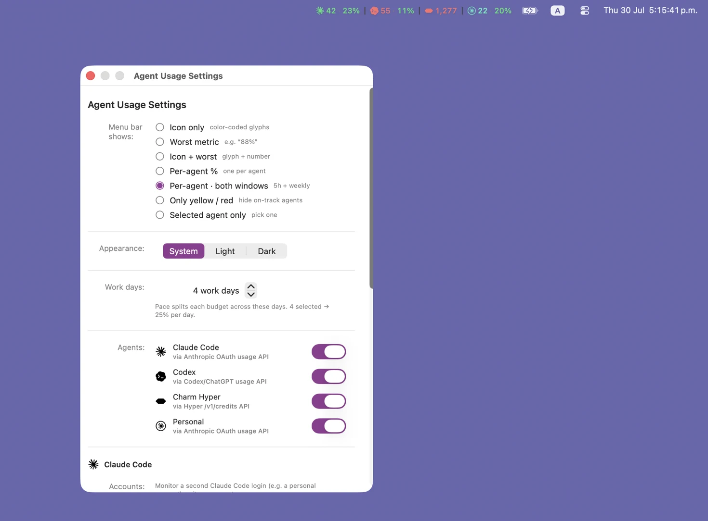
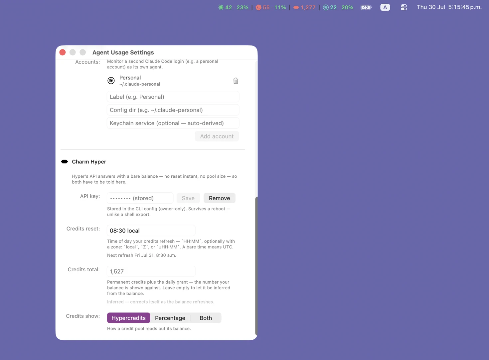
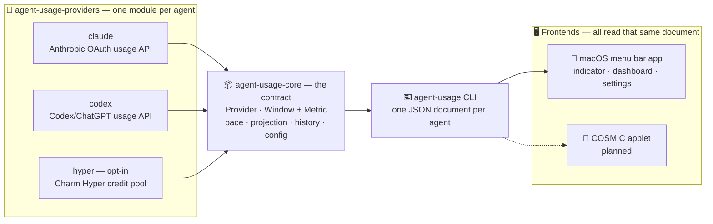

<!--
  All graphics below are self-hosted animated SVGs in docs/assets/ — no third-party
  services (no shields.io). GitHub strips inline CSS/JS from README HTML, but NOT the
  bytes of an image file it serves, so the SMIL <animate> inside these committed .svg
  files renders and animates when embedded with .
-->
<div align="center">





<br/><br/>

<sub><b>Claude Code&nbsp;·&nbsp;Codex&nbsp;·&nbsp;and whatever comes next — from one place.</b><br/>A cross-platform <b>CLI</b> with a single output contract, plus a <b>macOS menu bar</b> app and a <b>Linux COSMIC</b> applet that consume it.</sub>

</div>

---

Every coding agent meters you differently — a rolling five-hour session here, a
percentage of a weekly quota there, a credit balance that just burns down. This turns all
of them into the same question, asked once, in your menu bar: **am I on pace, or am I
going to run out?**

> [!WARNING]
> **Super alpha.** This is an early, personal-use project under active development. Expect rough
> edges, breaking changes without notice, and no stability, security, or support guarantees. There
> are no packaged releases — you build from source (see [Install](#-install)), and the macOS app is
> ad-hoc signed, not notarized. Use at your own risk.

This is the agent-agnostic successor to
[`claude-code-usage-indicator`](https://github.com/Fuabioo/claude-code-usage-indicator): same
pace-based coloring and dashboard ideas, generalized so that adding an agent is a small, isolated
change.

## ✨ What you get

<table>
<tr>
  <td align="center" width="25%">🎯<br/><b>Pace, not percentages</b><br/><sub>Colored by <i>today&#8217;s headroom</i> — a day ahead reads green, not &#8220;58% used&#8221;</sub></td>
  <td align="center" width="25%">🔌<br/><b>Agent-agnostic</b><br/><sub>One <code>Provider</code> trait; a new agent is one module and one registry line</sub></td>
  <td align="center" width="25%">🔥<br/><b>Burn rate &amp; burst brake</b><br/><sub>&#8220;out ~Thu at this rate&#8221; — rebuilt for agents that lost their session limit</sub></td>
  <td align="center" width="25%">📄<br/><b>One JSON contract</b><br/><sub>Every frontend reads the same document; no agent is special-cased</sub></td>
</tr>
</table>

## 📸 Screenshots

The menu bar shows each agent's `weekly · near-term %`, color-coded by pace; the dashboard popover
adds per-agent ring gauges, reset countdowns, and burn-rate context. Anything true of one agent
rather than of the run is shown on that agent: how old its reading is, a `cached` marker when it's
a fallback, and a refresh — hover a ring and it becomes the button that re-asks just that agent.



> [!NOTE]
> This example runs a multi-account, power-user setup — Codex, an opt-in
> [Charm Hyper](https://hyper.charm.land) credit pool, and a second "Personal" Claude login whose
> token has gone stale, which is why it reads `cached`. A fresh install shows just Claude Code +
> Codex.

<details>
<summary><b>Settings</b> — display, appearance, work-day split, per-agent blocks</summary>

<br/>

Settings control what the menu bar shows, appearance, the work-day pace split, and which agents are
enabled:



Below those sit one block per agent, for the settings only that agent has — an extra Claude Code
login, and everything Hyper's API can't report about itself:



</details>

## 📦 Install

No packaged release yet — build from source. It reads your existing Claude Code and Codex
credentials automatically, so the default two agents need no configuration.

### 1 · macOS menu bar app

Needs [Rust](https://rustup.rs) and the Xcode Command Line Tools (`xcode-select --install`):

```sh
git clone https://github.com/Fuabioo/agent-usage-tray.git
cd agent-usage-tray
macos/build-app.sh                       # builds the CLI + app → macos/build/AgentUsageMenuBar.app
open macos/build/AgentUsageMenuBar.app   # adds the menu bar item
```

> [!IMPORTANT]
> The app is ad-hoc signed (not notarized), so on first launch Gatekeeper blocks it: right-click
> the `.app` → **Open**, or clear the quarantine flag with
> `xattr -dr com.apple.quarantine macos/build/AgentUsageMenuBar.app`.

### 2 · CLI only

Needs just Rust:

```sh
cargo install --path crates/agent-usage-cli   # puts `agent-usage` on your PATH
agent-usage all --status                      # human-readable report for every default agent
```

### 3 · Charm Hyper (opt-in)

To add the [Charm Hyper](https://hyper.charm.land) credit pool, give it an API key — in the menu
bar app that's **Settings → Charm Hyper → API key**, for the CLI it's
`agent-usage config --save --hyper-api-key -` (the key is read from stdin so it never appears in
`ps`). It then joins `all` and the menu bar automatically.

> [!TIP]
> A `HYPER_API_KEY` export still works, but prefer the stored key: an app started at login inherits
> no shell profile, so an exported variable is invisible to it and Hyper would drop off the menu bar
> after every reboot.

<details>
<summary><b>Two things Hyper&#8217;s API can&#8217;t tell us</b> — the reset instant and the pool size</summary>

<br/>

Hyper's API reports only a balance — no reset instant — so it has to be told when your daily
credits refresh. In the menu bar app that's **Settings → Charm Hyper → Credits reset**; for the CLI
it's the config file (below), `--reset-time`, or the `HYPER_RESET_TIME` env var. The format is
`HH:MM` plus an optional zone, where a bare value means UTC — `"08:00 local"` tracks 8am on your
machine's clock through a DST change, where a hand-converted UTC value would drift an hour twice a
year. Unset defaults to midnight UTC; a malformed value is a hard error rather than a silent
fallback.

For the same reason — a lone balance, with no way to tell how much of it is today's grant — the
size of the pool that balance sits in is inferred from how it moves across refreshes. That is
self-correcting but not omniscient, so it can also be stated outright: **Settings → Charm Hyper →
Credits total** in the app, `--total-credits` or the config file for the CLI. It's permanent credits
plus the daily grant — the number your balance is shown against. Leave it unset to keep inferring.

</details>

## ⚙️ Configuration

Settings resolve **flag → environment → config file → built-in default**. The config file is the
CLI's own baseline, so a frontend passing its settings as arguments always wins:

```jsonc
// ~/.config/agent-usage/config.json   ($XDG_CONFIG_HOME honored)
{
  "work_days": 4,               // 1–7; daily_budget defaults to 100 / work_days
  "reset_time": "08:00 local",  // HH:MM + optional zone: `local`, `Z`, or ±HH:MM
  "total_credits": 1600,        // credit-pool size; unset = infer it from the balance
  "hyper_api_key": "…"          // written by `config --save`, never printed back
}
```

Every key is optional. A missing file is fine; one that exists but doesn't parse — including a
misspelled key — is a hard error, since a setting that silently fails to apply is exactly what the
file exists to prevent. The file is written `0600`, because it may hold an API key.

Inspect and edit it through the CLI rather than by hand:

```sh
agent-usage config --status                          # show settings (the key reads as <set>)
agent-usage config --save --work-days 4              # change one setting, leave the rest
agent-usage config --save --reset-time ""            # an empty value removes a setting
printf '%s' "$KEY" | agent-usage config --save --hyper-api-key -
```

The macOS app writes this file too, so the settings it owns stay in sync with what a hand-run
`agent-usage` sees; the flags it passes still override the file at runtime.

## 🧩 How it fits together

A small Cargo workspace. The core is pure logic; only the providers touch the network.


```mermaid
flowchart LR
    subgraph P["🔌 agent-usage-providers — one module per agent"]
        Claude["claude<br/>Anthropic OAuth usage API"]
        Codex["codex<br/>Codex/ChatGPT usage API"]
        Hyper["hyper — opt-in<br/>Charm Hyper credit pool"]
    end

    Core["📦 agent-usage-core — the contract<br/>Provider · Window + Metric<br/>pace · projection · history · config"]

    CLI["⌨️ agent-usage CLI<br/>one JSON document per agent"]

    subgraph F["🖥️ Frontends — all read that same document"]
        Bar["🍎 macOS menu bar app<br/>indicator · dashboard · settings"]
        Cosmic["🐧 COSMIC applet<br/>planned"]
    end

    Claude --> Core
    Codex --> Core
    Hyper --> Core
    Core --> CLI
    CLI --> Bar
    CLI -.-> Cosmic
```

**Why one normalized schema?** Agents measure usage differently. Claude reports rolling
percent-utilization windows; a credit-based agent reports a balance that burns down and can run
out before it refills. Every provider normalizes into a flat list of `Window`s, each carrying
either a `Utilization { used_pct }` or a `Pool { total, remaining, burn_per_day }` metric — so
the menu bar, dashboard, and CLI never special-case an agent.

**Adding an agent** = one module in `agent-usage-providers` implementing `Provider`, plus one
line in the registry. It then appears in `agent-usage list`, `agent-usage <id>`, and
`agent-usage all` automatically.

**Dependencies are kept minimal:** the core needs only `serde`/`chrono`/`thiserror`; providers
add a tiny blocking `ureq` (no async runtime, no `reqwest`) since the CLI is one-shot; the CLI
adds only `clap`.

<details>
<summary><b>Repository layout</b></summary>

<br/>

```
crates/
  agent-usage-core/        Pure logic, no GUI/network deps:
                           - Provider trait (the contract every agent implements)
                           - normalized schema: Window + Metric (percent-utilization OR
                             a consumable credit Pool), AgentInfo, Usage
                           - pace coloring (weekly pace, session thresholds, pool color)
                           - projection (burn-rate → depletion date, "out before reset?")
                           - usage history (sampled burn rate + short-horizon "burst" brake
                             for agents that bill a single multi-day quota)
                           - the CLI config file (lowest-precedence settings baseline)
  agent-usage-providers/   Concrete providers + a registry:
                           - claude  (real — Anthropic OAuth usage API; file + macOS Keychain)
                           - codex   (real — Codex/ChatGPT usage API at backend-api/wham/usage;
                             ChatGPT token from ~/.codex/auth.json — live, like Claude)
                           - hyper   (opt-in — Charm Hyper credit pool; API key from config)
                           - shared creds + tiny blocking HTTP helper (ureq)
  agent-usage-cli/         `agent-usage` binary: per-agent subcommands, one JSON/`--status`
                           contract for every agent.
macos/
  AgentUsageMenuBar/       macOS menu bar app (Swift/AppKit + SwiftUI). Spawns the bundled
                           `agent-usage all --json`, renders a per-agent bar indicator + a
                           dashboard popover (ring gauges, pace, burn-rate alerts) + settings.
  build-app.sh             Build the CLI + Swift app and assemble AgentUsageMenuBar.app.
```

</details>

## 🚀 CLI

```sh
agent-usage claude            # JSON snapshot for one agent (default output)
agent-usage claude --status   # human-readable report
agent-usage all               # JSON array: every default agent (Claude + Codex out of the box)
agent-usage list              # list the default agents and their sources
agent-usage hyper             # opt-in agent — joins `all` once its API key is stored
```

<details>
<summary><b>Common flags</b> — the same for every agent</summary>

<br/>

```sh
agent-usage claude --creds-path /path/to/.credentials.json
agent-usage claude --daily-budget 20 --work-days 5
agent-usage claude --timeout 30
agent-usage claude --keychain-service "Claude Code-credentials"   # macOS
agent-usage claude --no-keychain
agent-usage claude --cache-ttl 60      # reuse a cached snapshot for N secs (0 = always fetch)
agent-usage claude --no-cache          # never read/write the cache
```

</details>

**Caching.** JSON results are cached per agent at `~/.cache/agent-usage/<id>.json`. Repeated
calls within `--cache-ttl` (default 60s) reuse the cached snapshot instead of re-hitting the
usage source — this keeps the app's frequent polling from tripping API rate limits. On a
*transient* failure (rate limit, network) the last good snapshot is served instead of an error,
marked `"stale": true`; auth/credential errors still surface. (`--status` always fetches live.)
See [ADR-003](docs/ADR/003-caching-and-resilience.md).

<details>
<summary><b>The JSON contract</b> — the stable document every frontend consumes</summary>

<br/>

On failure it still prints valid JSON with an `error` object and exits non-zero. Shape (success):

```jsonc
{
  "agent":  { "id": "claude", "label": "Claude Code", "source": "Anthropic OAuth usage API" },
  "fetched_at": "2026-06-12T16:03:39Z",
  "config": { "daily_budget": 20.0, "work_days": 5 },
  "windows": [
    { "kind": "weekly",  "label": "weekly",  "used_pct": 58.0, "remaining_pct": 42.0,
      "resets_at": "...", "resets_in_secs": 294981, "pace": "green" },
    { "kind": "session", "label": "session", "used_pct": 4.0,  "remaining_pct": 96.0,
      "resets_at": "...", "resets_in_secs": 13581,  "pace": "green" }
  ],
  "pace": { "work_day_index": 4, "daily_ceiling": 80.0, "remaining": 22.0,
            "reset_day_local": "Mon Jun 15, 8:00 PM" },
  // Present once enough usage history has been sampled — see "Burn rate and the burst brake".
  "trend": { "burn_per_day": 24.0, "measured_over_secs": 86400,
             "projected_exhaustion": "...", "exhausts_before_reset": true,
             "recent": { "used_pct": 20.0, "span_secs": 18000, "pace": "red" } }
}
```

Credit-pool agents add a `pool` block to their window:

```jsonc
{ "kind": "credits", "label": "hypercredits", "used_pct": 87.8, "remaining_pct": 12.2,
  "pace": "red",
  "pool": { "total": 5000, "remaining": 610, "burn_per_day": 310,
            "projected_depletion": "...", "depletes_before_reset": true } }
```

</details>

## 🎨 Pace, burn rate, and the burst brake

Coloring answers **"am I on pace?"**, not "how much have I used?". A weekly window at 58% is
alarming on Tuesday and comfortable on Friday, so the bands are drawn against *today's headroom*
— `work_day_index * daily_budget` minus what you've spent. Being a full day under pace late in the
week reads green, or mint-with-a-glow for **surplus**, rather than "approaching the ceiling".

<details>
<summary><b>The bands, exactly</b></summary>

<br/>

- **Weekly** window: pace-based on **today's headroom**. Ceiling = `work_day_index *
  daily_budget`; `remaining = ceiling - used`. Bands scale with `daily_budget` (for the default
  20%/day: **surplus ≥ 40% left, green > 10%, yellow 5–10%, red ≤ 5% or over**) — surplus when
  you're a full day or more ahead of pace (banked budget; rendered mint with a glow), green
  above half a day's headroom, yellow down to a quarter day, red at a quarter day or less.
  `work_day_index` is counted in your **local timezone** — each reset-aligned period is
  attributed to the calendar day its working hours fall on, so a Monday-8pm reset makes Friday day
  4 of 5 (next Monday is the 5th). See [ADR-002](docs/ADR/002-pace-and-work-day-model.md).
- **Session** window: fixed thresholds (`≤50` green, `≤80` yellow, else red).
- **Credit pool**: red if projected to deplete before reset (or `≥90%` used), yellow at `≥75%`,
  else green.
- **Burst**: measured against **one work day's budget**, not against what's left — `≥` a full
  day's allowance inside the burst window is red, `≥` half is yellow.

</details>

### The burst brake

A short rolling window is self-limiting: you can't spend a week's budget in one afternoon while a
5-hour limit is also stopping you. Agents that bill a **single multi-day quota** (Codex now does)
have no such brake — one long sitting can quietly eat the whole cycle. So the CLI reconstructs
one by sampling each agent's weekly `used_pct` on every live fetch into
`~/.cache/agent-usage/<id>.history.json`, and derives:

- **burn rate** — percent of the cycle consumed per day, over the trailing 24h;
- **projected exhaustion** — when the cycle hits 100% at that rate, and whether that lands
  *before* it would have reset (the dashboard raises a red banner when it does);
- **burst** — percent of the cycle consumed in the last 5 hours. This is the replacement brake:
  it answers "how hot am I running *right now*" rather than "how much is left", and it takes the
  session window's place in the menu bar for agents that no longer expose one.

It needs no setup and stores nothing but timestamps and percentages. Trends appear once there is
enough history to be honest about (~30 min for the burst, ~2h for the rate) — until then the
`trend` key is simply absent rather than guessed. `--no-cache` opts out of the series entirely.

## 🍎 macOS menu bar app

`macos/AgentUsageMenuBar` is a menu-bar-only (`LSUIElement`) Swift/AppKit + SwiftUI app that
bundles and spawns the `agent-usage` CLI and renders its JSON. See
[ADR-004](docs/ADR/004-macos-frontend.md) for the design.

```sh
macos/build-app.sh                 # build CLI + app, assemble macos/build/AgentUsageMenuBar.app
open macos/build/AgentUsageMenuBar.app
```

Requires the Swift toolchain (Xcode Command Line Tools) plus Rust. The app finds the CLI via
`$AGENT_USAGE_BIN`, then its bundled `Resources/agent-usage`, then `PATH`. Agent logos are
committed vector PDFs (rendered from each agent's SVG with `macos/render-logos.sh` via headless
Chrome) and tinted per pace, so glyphs stay crisp at any size.

<details>
<summary><b>What each surface shows</b> — menu bar · dashboard · settings</summary>

<br/>

- **Menu bar** — one configurable indicator, agents separated by a divider and tinted by pace
  (mint when in surplus). Display modes (Settings → "Menu bar shows"): *icon only* (color-coded
  glyphs), *worst metric* (single highest %), *icon + worst*, *per-agent %*, *per-agent · both
  windows* (`weekly · near-term`, the default), *only yellow/red* (hide on-track agents), and
  *selected agent only*. The near-term number is the agent's session window, or — for agents that
  bill a single multi-day quota and expose none — the sampled 5h burst.
- **Dashboard popup** — "Today's pace": a ring gauge per agent showing today's headroom
  ("20% left", or "out ~Thu" for a depleting pool) and the agent's own work day (`day N/M`, since
  agents renew on different days); alert banners for any pool projected to run dry and any weekly
  budget on course to be spent before it resets ("weekly budget gone ~Thu at this rate · burning
  ≈24%/day · 20% in the last 5h"); and per-window rows showing each window's remaining plus its
  exact local reset moment ("resets Mon Jun 15, 8:00 PM · in 3d 8h"), followed by the burst line
  ("last 5h — 20% used"). Footer shows last-updated (with a "cached" marker when serving stale
  data), Refresh, and a settings gear.
- **Settings** — display mode, credit readout, credits reset time, appearance (System/Light/Dark),
  work days, and per-agent enable; persisted in `UserDefaults`. The credits-reset field echoes back
  the resolved next refresh (or the parse error) so you can see what the value did. Right-click the
  bar item for Refresh / Settings / Launch at Login / Quit.

</details>

## 🗺️ Status & roadmap

| Priority | Component                         | State                                            |
| -------- | --------------------------------- | ------------------------------------------------ |
| 1        | **`agent-usage` CLI**             | ✅ working — Claude (live), Codex (live), Hyper (opt-in), `all` |
| 2        | **macOS menu bar app**            | ✅ working — multi-agent bar + dashboard + settings |
| 3        | Linux COSMIC panel applet         | ⏳ planned (Rust/libcosmic, links the core)       |

## 📐 Design docs

Architecture decisions are recorded under [`docs/ADR/`](docs/ADR/):

- [ADR-001](docs/ADR/001-agent-agnostic-architecture.md) — agent-agnostic architecture (workspace,
  `Provider` trait, normalized schema, one JSON contract).
- [ADR-002](docs/ADR/002-pace-and-work-day-model.md) — pace coloring (today's-headroom bands,
  surplus) and the local-timezone work-day model.
- [ADR-003](docs/ADR/003-caching-and-resilience.md) — per-agent snapshot cache and stale-on-error.
- [ADR-004](docs/ADR/004-macos-frontend.md) — macOS frontend: consuming the CLI JSON, menu-bar
  display modes, and vector-PDF logo rendering.

## 🔨 Build & test

```sh
cargo build              # builds the whole workspace
cargo test               # runs core + provider + CLI tests
cargo run -p agent-usage-cli -- claude --json
```

Requires a Rust toolchain. (No `just`/Homebrew packaging yet — that lands later.)

## 📄 License

[MIT](LICENSE) © 2026 Fabio Mora

---

<div align="center">
<sub>Built by <a href="https://github.com/Fuabioo">Fuabioo</a> · <a href="docs/ADR/">design rationale in docs/ADR</a></sub>
<br/><br/>

</div>
